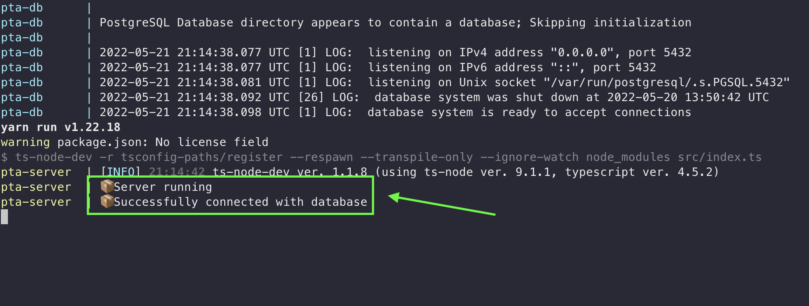
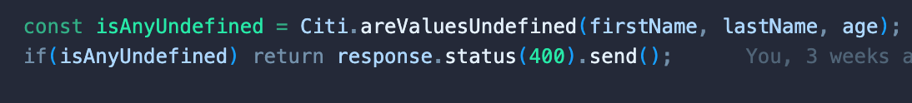
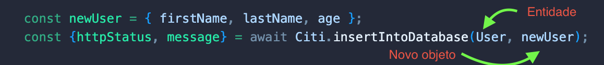
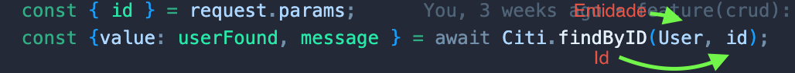
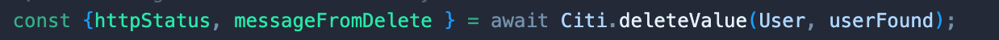
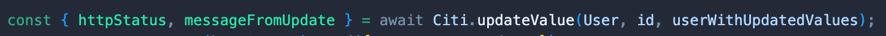
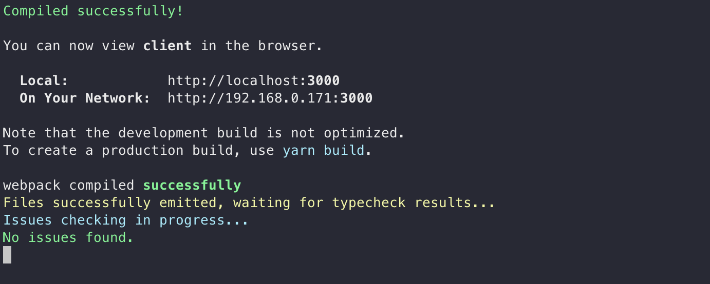

<!-- PROJECT LOGO -->
<br />
<p align="center">
  <a href="https://github.com/apfdamascena/pta-boilerplate">
    
  </a>

  <h3 align="center">PTA</h3>

  <p align="center">
  Esse boilerplate foi criado durante o processo seletivo de 2022 do CITi e ele tem o intuito de aproximar as pessoas aspirantes à realidade
  dentro do CITi. O boilerplate será usado durante a última etapa do processo seletivo, a qual tem o objetivo de capacitar tecnincamente as pessoas que entrarão no CITi.
    <br />
    <a href="https://github.com/apfdamascena/pta-boilerplate"><strong>Explore the docs »</strong></a>
    <br />
    <br />
    ·
    <a href="https://github.com/apfdamascena/pta-boilerplate/issues">Report Bug</a>
    ·
    <a href="https://github.com/apfdamascena/pta-boilerplate/issues">Request Feature</a>
  </p>
</p>


<!-- TABLE OF CONTENTS -->
<details open="open">
  <summary><h2 style="display: inline-block">Tabela de Conteúdo</h2></summary>
  <ol>
    <li><a href="#about-boilerplate">About Boilerplate</a></li>
    <li><a href="#server">Server</a></li></li>
    <ul>
        <li><a href="#how-to-install">How To Install</a></li></li>
        <li><a href="#how-to-run">How To Run</a></li></li>
        <li><a href="#citi-abstraction-documentation">Citi Abstraction Documentation</a></li></li>
        <ul>
        <li><a href="#are-values-undefined">Are Values Undefined</a></li></li>
        <li><a href="#insert-into-database">Insert Into Database</a></li></li>
        <li><a href="#get-all">Get All</a></li></li>
        <li><a href="#find-by-id">Find By ID</a></li></li>
        <li><a href="#delete-value">Delete Value</a></li></li>
        <li><a href="#delete">Update</a></li></li>
        </ul>
    </ul>
    <li><a href="#client">Client</a></li>
        <ul>
        <li><a href="#how-to-install-client">How To Install Client</a></li></li>
        <li><a href="#how-to-run-client">How To Run Client</a></li></li>
        </ul>
    </ul>
    <li><a href="#add-new-dependencies">Add New Dependencies</a></li>
    <li><a href="#contact">Contact</a></li>
  </ol>
</details>

<br/> 

## About Boilerplate
<br/>

  Esse boilerplate foi criado durante o processo seletivo de 2022 do CITi e ele tem o intuito de aproximar as pessoas aspirantes à realidade
  dentro do CITi. O boilerplate será usado durante a última etapa do processo seletivo, a qual tem o objetivo de capacitar tecnincamente as pessoas que entrarão no CITi.
  O template foi criado em um monorepo e está estruturado em cliente e servidor.

<p align= "center">
    
</p>

O server tem uma estrutura base de código para a construção de uma API. Já o cliente, contém uma outra estrutura base de código para a construção de todo o frontend da aplicação. 
Ainda no server, tem uma abstração construída para facilitar o contato de pessoas aspirantes com a construção de uma API.


<br/> 

## Server

<br/>

## How To Install

<br/>

0. Certifique-se que o node esteja devidamente instalado. 

1. Clone o repositório

   ```sh
   git clone URL_DO_REPOSITÓRIO
   ```

2. Entre na pasta /server do repositório

3. Abra a pasta /server no vscode

4. Vá em terminal e abra o novo terminal 

5. Com o terminal aberto, escreva essa sentença abaixo e dê enter

   ```sh
   yarn install
   ```

   ou 

   ```sh
   npm install
   ```

<br/> 

## How To Run

<br/>

0. Certifique-se que o docker esteja devidamente instalado
1. Com a pasta /server aberta no vscode, crie um novo arquivo e o nomeie de ".env"
2. Dentro desse novo arquivo criado, coloque esse texto abaixo

   ```javascript
    DATABASE_TYPE=postgres
    DATABASE_PORT=5432
    DATABASE_HOST=pta-db
    DATABASE_USER=root
    DATABASE_PASSWORD=123456
    DATABASE_NAME=pta
    DATABASE_DB=pta-one-page
   ```
3. Abra um novo terminal no vscode
4. Com o terminal aberto, escreva essa sentença abaixo e dê enter

   ```sh
   docker-compose up
   ```

   ou 

   ```sh
   docker compose up
   ```

5. Espere que o terminal esteja dessa maneira

    <p align= "center">
        
    </p>

<br/> 

## Citi Abstraction Documentation

<br/>

### Are Values Undefined

<br/>

Essa função verifica se existe um valor undefined passando no argumento.

- Observação: Essa função recebe quantos argumentos forem preciso.

   
    
   ```javascript 
    Retorna o booleano true caso exista valores undefnined
   ```

   ```javascript
    Retorna o booleano false caso exista valores undefnined
   ```

Exemplo:
<p align= "center">
    
    </p>

<br/> 

### Insert Into Database

<br/>

Essa função tem a finalidade de inserir um valor de modelo dentro de um banco de dados.

- Observação: Essa função recebe o modelo de entidade e o novo objeto a ser inserido como argumentos.

<br/>

   ```javascript 
    Retorna https 201 caso o procedimento ocorra de forma correta
   ```

   ```javascript
    Retorna https 400 caso o procedimento NÃO ocorra de forma correta
   ```


Exemplo:
<p align= "center">
    
    </p>

<br/> 

### Get All

<br/>

Essa função tem a finalidade de pegar TODOS os valores de modelo dentro de um banco de dados.

- Observação: Essa função recebe o modelo de entidade como argumento.

<br/>

   ```javascript 
    Retorna https 200 caso o procedimento ocorra de forma correta
   ```

   ```javascript
    Retorna https 400 caso o procedimento NÃO ocorra de forma correta
   ```


Exemplo:
<p align= "center">
    
    </p>

<br/> 

### Find By Id

<br/>

Essa função tem a finalidade de procurar um valor de modelo dentro de um banco de dado, utilizando o ID.

- Observação: Essa função recebe o modelo de entidade e o ID como argumento.

<br/>

   ```javascript 
    Retorna o valor procurado caso o procedimento ocorra de forma correta
   ```

   ```javascript
    Retorna undefined caso o procedimento NÃO ocorra de forma correta
   ```


Exemplo:
<p align= "center">
    
    </p>

<br/> 


### Delete Value

<br/>

Essa função tem a finalidade de deletar um valor de modelo dentro de um banco de dado, utilizando o ID.

- Observação: Essa função recebe o modelo de entidade e o obejto a ser retirado como argumento.

<br/>

   ```javascript 
    Retorna https 200 caso o procedimento ocorra de forma correta
   ```

   ```javascript
    Retorna https 400 caso o procedimento NÃO ocorra de forma correta
   ```

Exemplo:
<p align= "center">
    
    </p>

<br/> 

### Update Value

<br/>

Essa função tem a finalidade de atualizar um valor de modelo dentro de um banco de dado, utilizando o ID.

- Observação: Essa função recebe o modelo de entidade, o ID e o novo objeto como argumentos.

<br/>

   ```javascript 
    Retorna https 200 caso o procedimento ocorra de forma correta
   ```

   ```javascript
    Retorna https 400 caso o procedimento NÃO ocorra de forma correta
   ```

Exemplo:
<p align= "center">
    
    </p>

<br/> 

## Client

<br/>

## How To Install Client

<br/>

1. Entre na pasta /client do repositório

2. Abra a pasta /client  no vscode

3. Vá em terminal e abra o novo terminal 

4. Com o terminal aberto, escreva essa sentença abaixo e dê enter

   ```sh
   yarn install
   ```

   ou 

   ```sh
   npm install
   ```

<br/> 

## How To Run Client

<br/>

1. Entre na pasta /client do repositório

2. Abra a pasta /client no vscode

3. Vá em terminal e abra o novo terminal 

4. Com o terminal aberto, escreva essa sentença abaixo e dê enter

   ```sh
   yarn start
   ```

   ou 

   ```sh
   npm run start
   ```

3. Espere que o terminal esteja dessa maneira

    <p align= "center">
        
    </p>

<br/> 

## Add New Dependencies

<br/>

Não instale novas dependências sem a autorização da pessoa gerente do projeto. Caso seja preciso, converse com gerentes e peça direcionamento 
de como faz para adicionar. 


<br/> 

## Contact

<br/>

- Alex Damsacena - apfd@cin.ufpe.br