<!-- PROJECT LOGO -->
<br />
<p align="center">
  <a href="https://github.com/apfdamascena/pta-boilerplate">
    
  </a>

  <h3 align="center">PTA</h3>

  <p align="center">
  Esse boilerplate foi criado durante o processo seletivo de 2022 do CITi e ele tem o intuito de aproximar as pessoas aspirantes à realidade
  dentro do CITi. O boilerplate será usado durante a última etapa do processo seletivo, a qual tem o objetivo de capacitar tecnincamente as pessoas que entrarão no CITi.
    <br />
    <a href="https://github.com/apfdamascena/pta-boilerplate"><strong>Explore the docs »</strong></a>
    <br />
    <br />
    ·
    <a href="https://github.com/apfdamascena/pta-boilerplate/issues">Report Bug</a>
    ·
    <a href="https://github.com/apfdamascena/pta-boilerplate/issues">Request Feature</a>
  </p>
</p>


<!-- TABLE OF CONTENTS -->
<details open="open">
  <summary><h2 style="display: inline-block">Tabela de Conteúdo</h2></summary>
  <ol>
    <li><a href="#about-boilerplate">About Boilerplate</a></li>
    <li><a href="#deploy-server">Deploy Server</a></li></li>
    <li><a href="#contact">Contact</a></li>
  </ol>
</details>

<br/> 

## About Boilerplate
<br/>

  Esse boilerplate foi criado durante o processo seletivo de 2022 do CITi e ele tem o intuito de aproximar as pessoas aspirantes à realidade
  dentro do CITi. O boilerplate será usado durante a última etapa do processo seletivo, a qual tem o objetivo de capacitar tecnincamente as pessoas que entrarão no CITi.
  O template foi criado em um monorepo e está estruturado em cliente e servidor.

<p align= "center">
    
</p>

O server tem uma estrutura base de código para a construção de uma API. Já o cliente, contém uma outra estrutura base de código para a construção de todo o frontend da aplicação. 
Ainda no server, tem uma abstração construída para facilitar o contato de pessoas aspirantes com a construção de uma API.


<br/> 

## Deploy Server

<br/>

0. Crie uma conta Heroku https://www.heroku.com/
1. Instale Heroku CLI através desse link https://devcenter.heroku.com/articles/heroku-cli
2. No terminal do seu computador, utilize esse comando para fazer login na sua conta heroku

   ```sh
   heroku login
   ```

3. Abaixo segue os passos para criar um app heroku.

    <p align="center">
      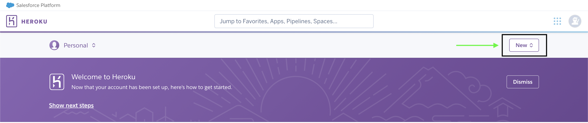
      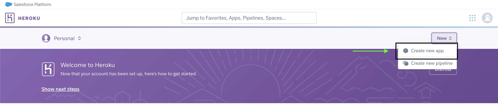
      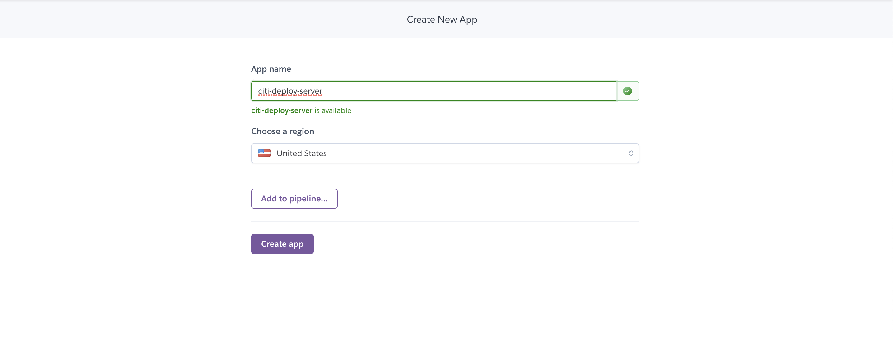
    </p>

4. Essa tela irá aparecer e precisaremos fazer algumas configurações. Dessa forma, clique em "Settings".

    <p align="center">
      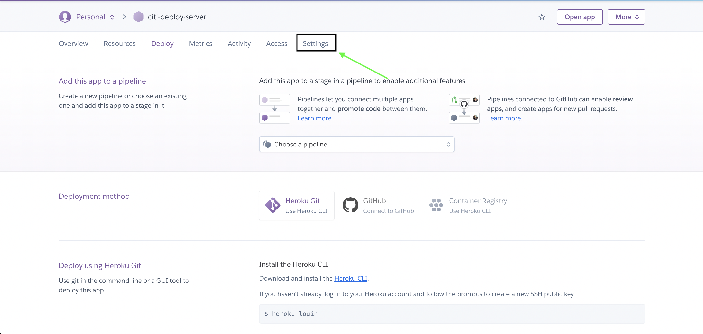
    </p>


5. Precisamos adicionar o node como build pack. Dessa forma, cliquem no botão de adicionar buildpack, escolham node e confirmem.

    <p align="center">
      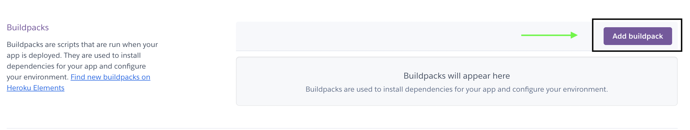
    </p>

6. Agora iremos configurar nosso banco de dados no heroku. Dessa forma, cliquem em "Resources" e sigam esses passos.

    <p align="center">
      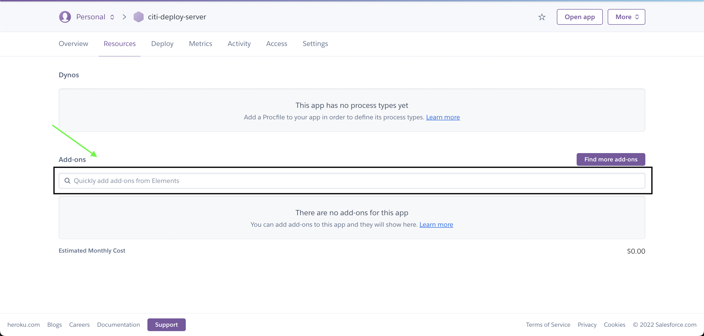
      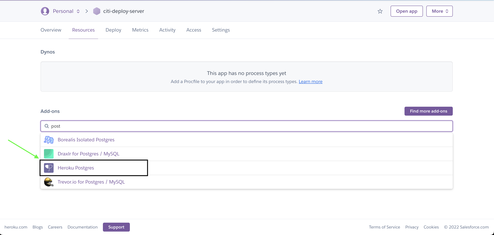
      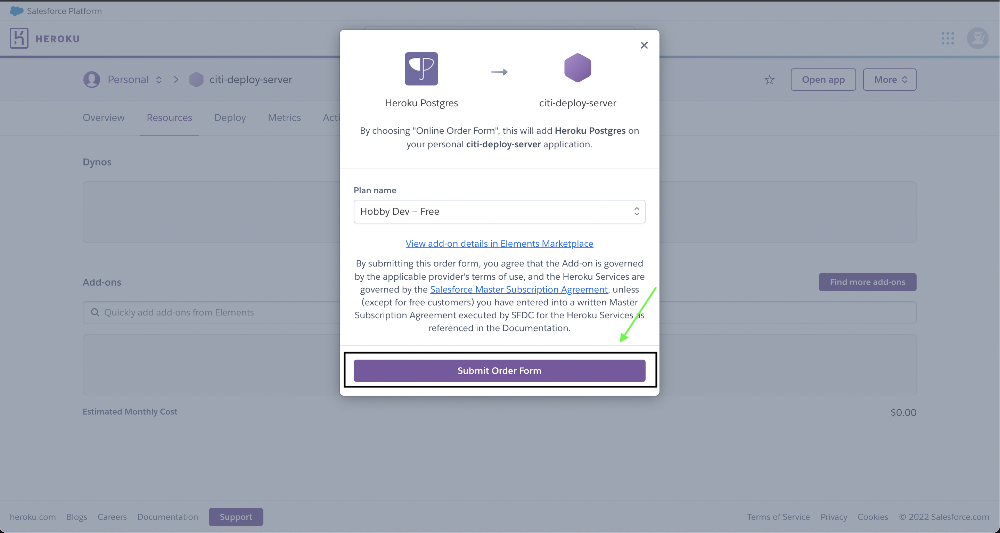
    </p>

7. Com isso, conseguiremos ter informações do nosso banco de dados. Para conseguirmos elas, precisamos seguir os seguintes passos. No final desse passo, colete as informações de HOST, DATABASE, USER, PORT, PASSWORD.

      <p align="center">
      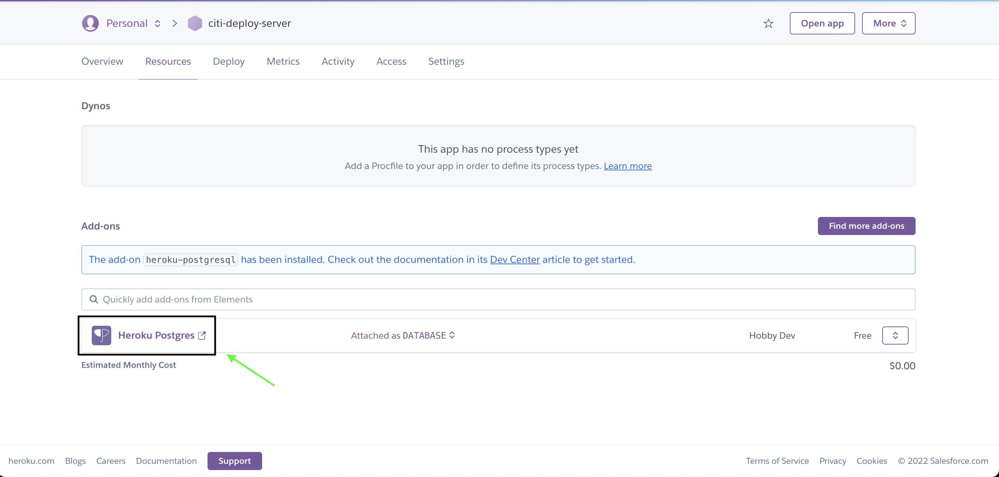
      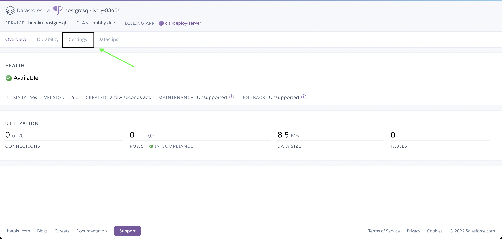
      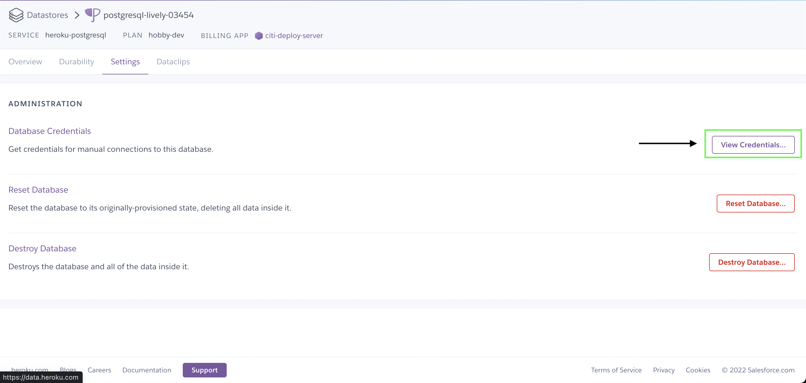
      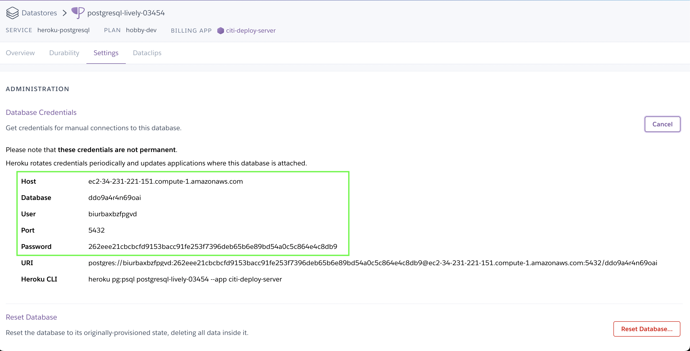
    </p>


8. Para finalizar, voltem ao app da Heroku e sigam as seguintes instruções para configurar as variaveis de ambiente do projeto. Coloquem as informações obtidas do banco de dados e notem que há outras variaveis de ambinte. GARANTAM QUE TODAS SEJAM COLOCADAS.

    <p align="center">
      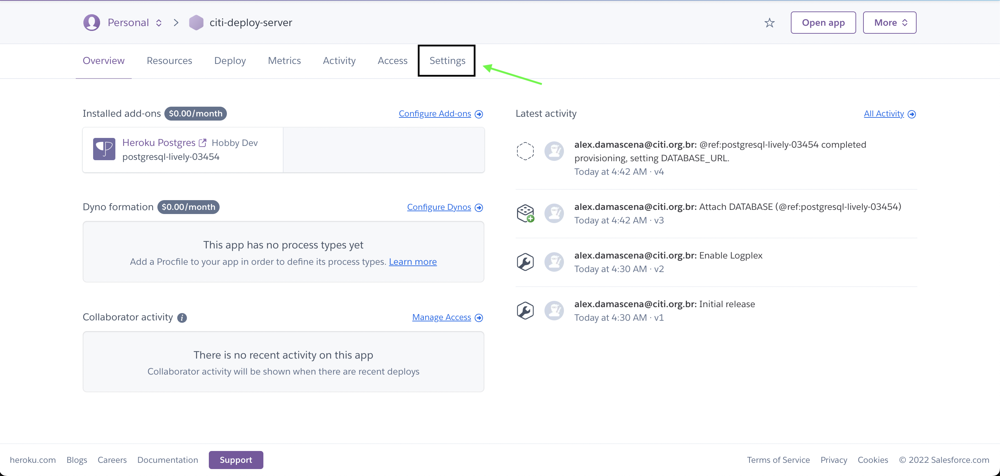
      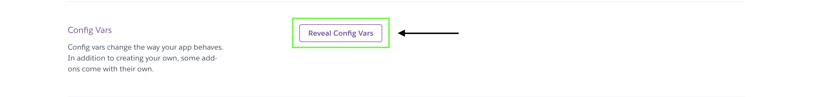
      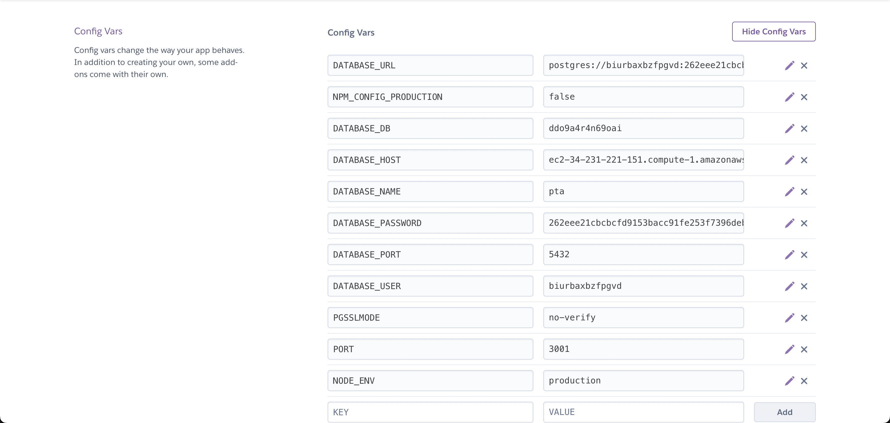
    </p>


9. Entre na pasta /server do repositório.

10. Inicialize um repositório git com o seguinte comando.

  ```sh
    git init
   ```

11. Ao inicializar o repositório git, escreva o seguinte comando. Atenção nome_do_app é o nome criado anteriormente.

  ```sh
    heroku git:remote -a nome_do_app
   ```

12. Construa o build com o seguinte comando. Garant que você tenha dado o yarn install antes.


  ```sh
      yarn build
   ```

13. Agora é só dar as seguintes instruções

  ```sh
      git add .
   ```

  ```sh
      git commit -am "first deploy"
   ```

  ```sh
      git push heroku main
   ```

14. Ao final desse processo, aparecerá a url de onde está o deploy

    <p align="center">
      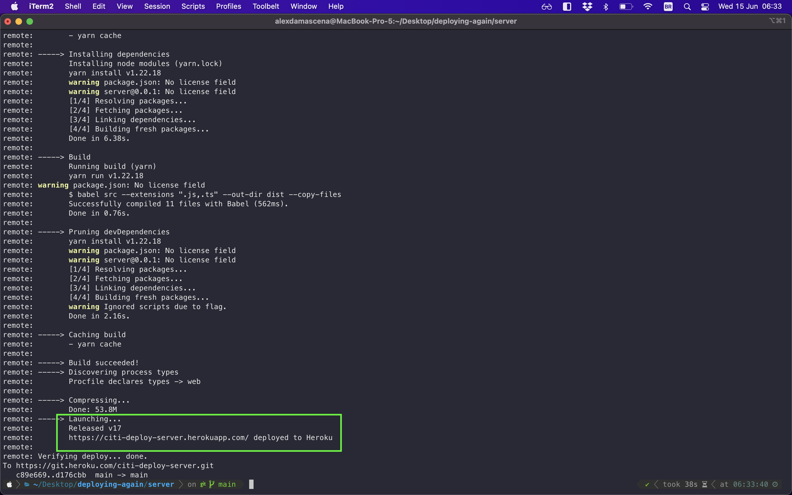
    </p>

15. Para ver os logs do deploy, utilizem o seguinte comando. Caso apareça algum erro, google it.

  ```sh
      heroku logs --tail
   ```

<p align="center">
  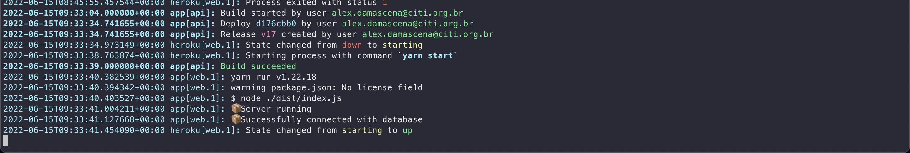
</p>

## Contact

<br/>

- Alex Damsacena - apfd@cin.ufpe.br